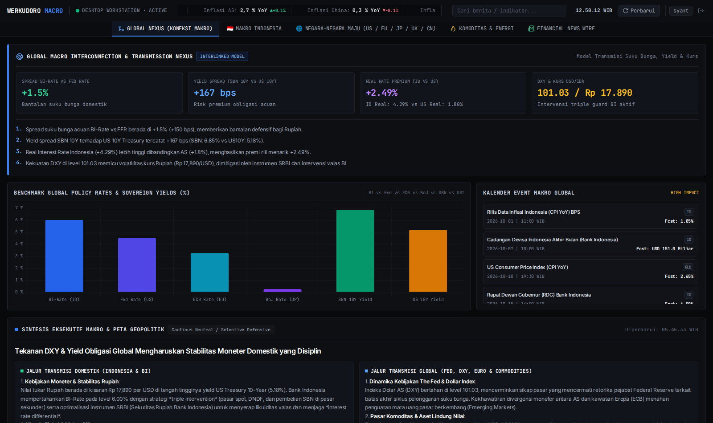
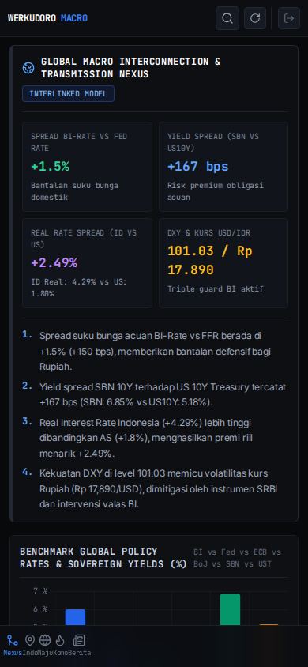

<div align="center">

# 🏛️ Werkudoro Macroeconomic Intelligence Portal
### *Institutional-Grade Macroeconomic Radar, Cross-Asset Opportunity Matrix & Autonomous Intelligence Core*

[](LICENSE)
[](https://python.org)
[](https://fastapi.tiangolo.com)
[](.agents/COMPANY_CHARTER.md)
[](#ui-craft--antarmuka)
[](#)

[Live Production Portal](https://macro.synt.dpdns.org) • [Arsitektur Sistem](#-arsitektur-sistem) • [7 Pilar Intelijen](#-7-pilar-intelijen-makroekonomi) • [Tim Agent synt-wrkdr-1](#-organisasi-startup-agent-synt-wrkdr-1) • [API Docs](#-api-endpoints)

---

</div>

## 📌 Executive Summary & Goals

**Werkudoro Macroeconomic Intelligence Portal** adalah platform pemantauan, riset, dan analisis makroekonomi terintegrasi berstandar *Institutional Financial Terminal* (Bloomberg / TradingView style).

Platform ini dibangun bukan hanya sebagai penampil data angka, melainkan sebagai **Mesin Pengambilan Keputusan Strategis (Strategic Decision Engine)** yang menghubungkan dinamika makro global dengan realitas ekonomi Indonesia dan pasar keuangan lintas aset.

### 🎯 7 Pilar Utama Intelijen:

1. **Arah Ekonomi Global:** Membaca tren moneter The Federal Reserve (Fed), European Central Bank (ECB), kebijakan likuiditas China, US 10-Year Treasury Yield, dan indeks kekuatan Dolar AS (DXY).
2. **Kesehatan Makroekonomi Indonesia:** Analisis komprehensif transmisi kebijakan Bank Indonesia (BI-Rate), cadangan devisa, neraca perdagangan, inflasi IHK, dan pertumbuhan PDB riil.
3. **Forex & Kurs Valuta Asing:** Proyeksi dinamika nilai tukar USD/IDR, EUR/USD, dan JPY, serta dampaknya terhadap beban impor dan utang korporasi.
4. **Pasar Kripto (Crypto Macro Cycle):** Analisis likuiditas global (M2 Supply & Fed Balance Sheet) terhadap pergerakan aset digital utama (Bitcoin & Ethereum).
5. **Emas (Gold / XAU) & Safe Haven:** Pemantauan real yields, tensi geopolitik, tren diversifikasi cadangan devisa (de-dollarization), dan safe-haven capital flows.
6. **Komoditas & Sumber Daya Energi:** Real-time data minyak mentah (Brent / WTI), Batubara (Newcastle), dan Minyak Sawit (CPO) sebagai penopang utama ekspor dan fiskal Indonesia.
7. **Pasar Modal (IHSG vs Wall Street):** Rotasi sektoral saham Indonesia (Perbankan, Energi, Konsumer) berbanding indeks global (S&P 500, Nasdaq 100).
8. **Opportunity & Risk Radar (Winners vs. Losers):** Algoritma identifikasi entitas, sektor, dan instrumen yang paling diuntungkan atau dirugikan oleh rezim makro yang sedang berlangsung.
9. **Actionable Guidance:** Panduan konkret yang dapat dieksekusi untuk:
   - 🛡️ **Keputusan Hidup:** Rasio dana darurat, timing pembelian aset besar, strategi cash vs utang.
   - 📈 **Keputusan Trading/Investasi:** Alokasi aset, timing entry/rebalancing di instrumen saham, crypto, emas, atau obligasi negara (SBN).
   - 🏢 **Keputusan Bisnis Riil:** Kapan waktu tepat ekspansi usaha, belanja modal (CAPEX), renegosiasi supplier, atau hedging transaksi valas.

---

## 📸 Antarmuka Sistem (High-Craft Financial Terminal)

Platform dirancang dengan filosofi desain berdensitas tinggi, navigasi mobile thumb-dock jempol, dan **menolak keras AI Slop** (tanpa gradien mencolok atau animasi berlebih).

| Desktop Terminal View | Mobile Thumb-Dock View |
| :---: | :---: |
|  |  |

---

## 🏛️ Organisasi Startup Agent (`synt-wrkdr-1`)

Proyek ini dikembangkan dan dirawat secara otonom oleh **Werkudoro Multi-Agent Virtual Startup (Unit #1: `synt-wrkdr-1`)**. Setiap agent memiliki batas kapabilitas tegas (*Single Responsibility Principle*) dan berkomunikasi melalui artefak tertulis resmi.

```text
                                [ Herman Syantoso (Founder) ]
                                              │
                                              ▼
                                    [ CEO-synt-wrkdr-1 ]
                               (Strategi & Arah Perusahaan)
                                              │
                    ┌─────────────────────────┴─────────────────────────┐
                    ▼                                                   ▼
           [ CPO-synt-wrkdr-1 ]                               [ MACRO-synt-wrkdr-1 ]
     (Backlog Radar, User Journey)                       (Model Ekonomi, Analisis Aset)
                    │                                                   │
                    └─────────────────────────┬─────────────────────────┘
                                              ▼
                                    [ CTO-synt-wrkdr-1 ]
                              (Arsitektur Sistem & API Specs)
                                              │
                    ┌─────────────────────────┴─────────────────────────┐
                    ▼                                                   ▼
       [ FRONTEND-synt-wrkdr-1 ]                            [ BACKEND-synt-wrkdr-1 ]
     (Terminal UI, Mobile Thumb)                           (FastAPI, Pipeline Data)
                    │                                                   │
                    └─────────────────────────┬─────────────────────────┘
                                              ▼
                                     [ QA-synt-wrkdr-1 ]
                                (Adversarial Sentinel & Veto)
                                              │
                                              ▼ [PASS]
                                   [ DEVOPS-synt-wrkdr-1 ]
                               (Git, Systemd, Release, SRE)
```

### Roster Tim Agent:

- 👔 **`CEO-synt-wrkdr-1`** (`ceo.synt-wrkdr-1@hermes.local`): Menjaga keselarasan dengan visi pendiri dan memberikan otorisasi rilis strategis.
- 📋 **`CPO-synt-wrkdr-1`** (`cpo.synt-wrkdr-1@hermes.local`): Mengelola `RADAR_BACKLOG.md` dan memecah kebutuhan menjadi tugas atomik.
- 📊 **`MACRO-synt-wrkdr-1`** (`macro.synt-wrkdr-1@hermes.local`): Otak model ekonomi, matriks korelasi aset silang, dan formula sentimen rezim.
- 📐 **`CTO-synt-wrkdr-1`** (`cto.synt-wrkdr-1@hermes.local`): Penjaga arsitektur, SLA performa latency <100ms, dan spesifikasi API OpenAPI.
- 🎨 **`FRONTEND-synt-wrkdr-1`** (`frontend.synt-wrkdr-1@hermes.local`): Pengrajin UI Emil Kowalski craft, tabular numbers, dual-theme (Dark Matte / Light Paper).
- ⚙️ **`BACKEND-synt-wrkdr-1`** (`backend.synt-wrkdr-1@hermes.local`): Rekayasa backend FastAPI, async ingestion scheduler, database pooling PostgreSQL/SQLite.
- 🛡️ **`QA-synt-wrkdr-1`** (`qa.synt-wrkdr-1@hermes.local`): Penguji tanpa kompromi. Mengoperasikan automated test Playwright & Pytest dengan hak veto penghentian deploy (*Iron Stop Signal*).
- 🚀 **`DEVOPS-synt-wrkdr-1`** (`devops.synt-wrkdr-1@hermes.local`): Manajemen Git release, systemd daemon, Cloudflare zero-trust tunnel, dan pelaporan Telegram.

*Dokumentasi tata kelola lengkap tersedia di [`.agents/COMPANY_CHARTER.md`](.agents/COMPANY_CHARTER.md).*

---

## ⚡ Arsitektur Sistem & Tech Stack

```text
┌────────────────────────────────────────────────────────────────────────┐
│                          KONSUMEN PENGGUNA                             │
│   Web Browser (Desktop / Mobile)  ◄───►  Cloudflare Tunnel (TLS)       │
└───────────────────────────────────┬────────────────────────────────────┘
                                    │ Port 8000
                                    ▼
┌────────────────────────────────────────────────────────────────────────┐
│                     FASTAPI CORE ENGINE (LXC Host)                     │
│  ├── /api/indicators  (Market Quotes & Macro Benchmarks)               │
│  ├── /api/news        (Aggregated RSS & Sentiment Classifier)          │
│  ├── /api/opportunity (Cross-Asset Impact & Regime Matrix)             │
│  └── /api/briefing    (Executive AI-Generated Macro Briefing)          │
└───────────────────┬───────────────────────────────┬────────────────────┘
                    │                               │
                    ▼ Ingestion                     ▼ Persistence
┌──────────────────────────────────────┐  ┌──────────────────────────────┐
│       ASYNC DATA COLLECTORS          │  │       DUAL STORAGE TIER      │
│ • Yahoo Finance (USD/IDR, Yield, DXY)│  │ • PostgreSQL (Production DB) │
│ • Bank Indonesia & BPS Open Metrics  │  │   LXC 106 (trading_db/macro) │
│ • Commodity Quotes (Brent, Coal, CPO)│  │ • SQLite (Local Cache)       │
│ • Multi-Source RSS News Feeds        │  │   data/macro.db              │
└──────────────────────────────────────┘  └──────────────────────────────┘
```

---

## 🔄 Autonomous Improvement Loop (`ulw-loop`)

Repositori ini mendukung siklus perbaikan berkelanjutan secara otonom (*self-driving engineering*):

```bash
# Menjalankan siklus loop terverifikasi
python3 .agents/loop_runner.py
```

1. **Task Selection:** Runner membaca tiket belum terselesaikan teratas dari `RADAR_BACKLOG.md`.
2. **Branching & Implementation:** Agen terkait mengimplementasikan perubahan pada branch terisolasi.
3. **Iron Stop Signal (QA Gate):** Linter, Pytest, dan Playwright test dieksekusi secara otomatis.
4. **Autonomous Deployment:** Jika uji lolos 100%, DevOps agent menggabungkan branch, me-restart unit systemd `macro-portal.service`, dan mengirimkan bukti ringkasan ke Telegram.

---

## 🚀 Quickstart & Instalasi Lokal

### Prasyarat
- Python 3.12+ / Python 3.14
- Virtualenv
- Git & modern web browser

### 1. Clone & Setup Environment
```bash
git clone https://github.com/hermansyan/werkudoro-macro-portal.git
cd werkudoro-macro-portal

# Buat virtualenv
python3 -m venv venv
source venv/bin/activate

# Install dependensi
pip install -r requirements.txt  # atau pip install fastapi uvicorn httpx beautifulsoup4 feedparser yfinance
```

### 2. Konfigurasi Environment
```bash
cp .env.example .env
# Sesuaikan parameter database atau gunakan SQLite default
```

### 3. Jalankan Server
```bash
# Development mode
uvicorn app.main:app --host 0.0.0.0 --port 8000 --reload

# Akses via browser:
# http://localhost:8000
```

---

## 📡 API Endpoints

| Endpoint | Method | Deskripsi |
| :--- | :---: | :--- |
| `/api/status` | `GET` | Health status engine, waktu sinkronisasi, dan statistik database |
| `/api/indicators` | `GET` | Data real-time indikator makro (USD/IDR, BI-Rate, US 10Y, DXY, Emas, Minyak) |
| `/api/news` | `GET` | Feed berita terkurasi dengan filter sentimen, kategori, dan negara |
| `/api/calendar` | `GET` | Jadwal kalender rilis data ekonomi (FOMC, RDG BI, rilis inflasi) |
| `/api/briefing` | `GET` | Ringkasan eksekutif makroekonomi otomatis |
| `/api/refresh` | `POST` | Trigger pembaruan background scheduler secara manual |

---

## 🗺️ Roadmap Pengembangan

- [x] Inisialisasi arsitektur multi-agent `synt-wrkdr-1` & repositori open source.
- [x] Dual-theme Institutional Financial Terminal (Dark Matte / Light Paper).
- [x] Mobile thumb-dock navigation & layout responsif.
- [ ] Ingestion feed komoditas batubara & CPO real-time.
- [ ] Modul visual **Opportunity Radar** (Winners vs Losers matrix & actionable guidance).
- [ ] Integrasi automated E2E testing suite dengan Playwright.
- [ ] Notifikasi Telegram digest terjadwal 1 jam sekali via Hermes bot.

---

## 📄 Lisensi & Kontribusi

Didistribusikan di bawah lisensi **MIT License**. Lihat file [`LICENSE`](LICENSE) untuk detail lengkap.

Dikelola dan diarsiteki oleh **Herman Syantoso** bersama **Werkudoro Autonomous AI Core** (`synt-wrkdr-1`).
